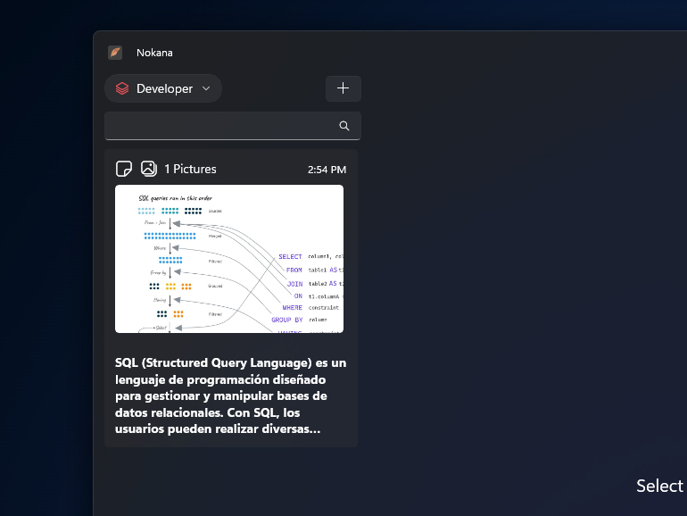
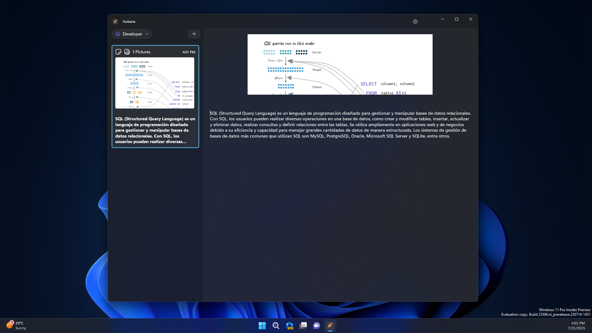
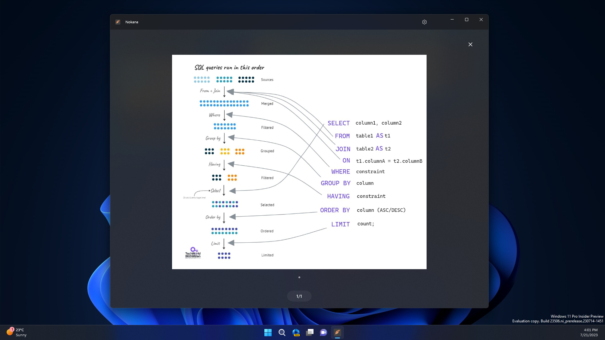
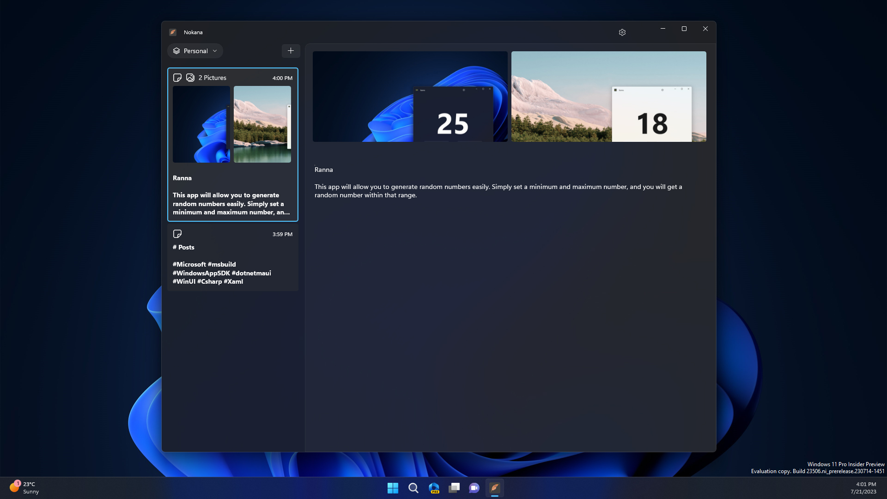
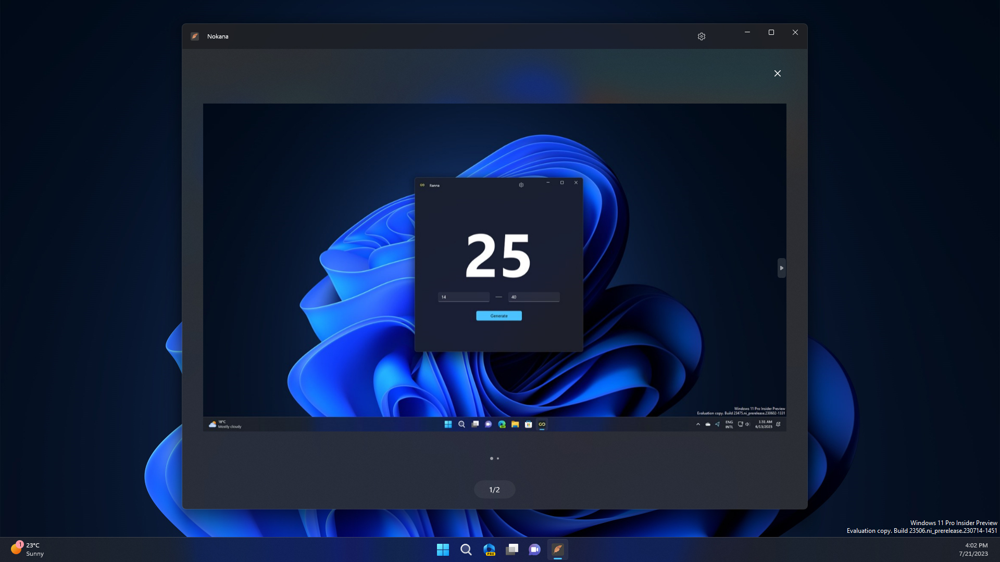
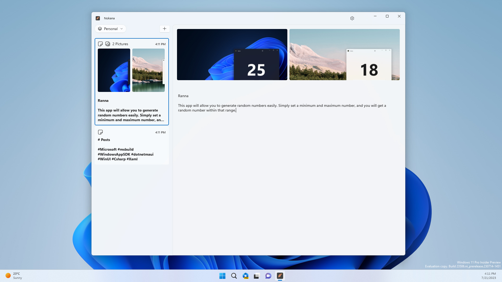
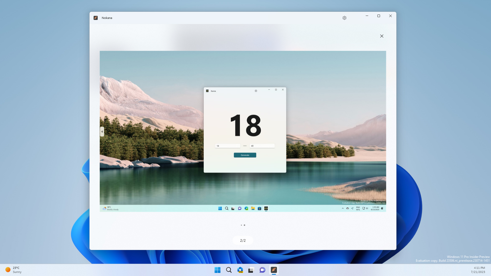
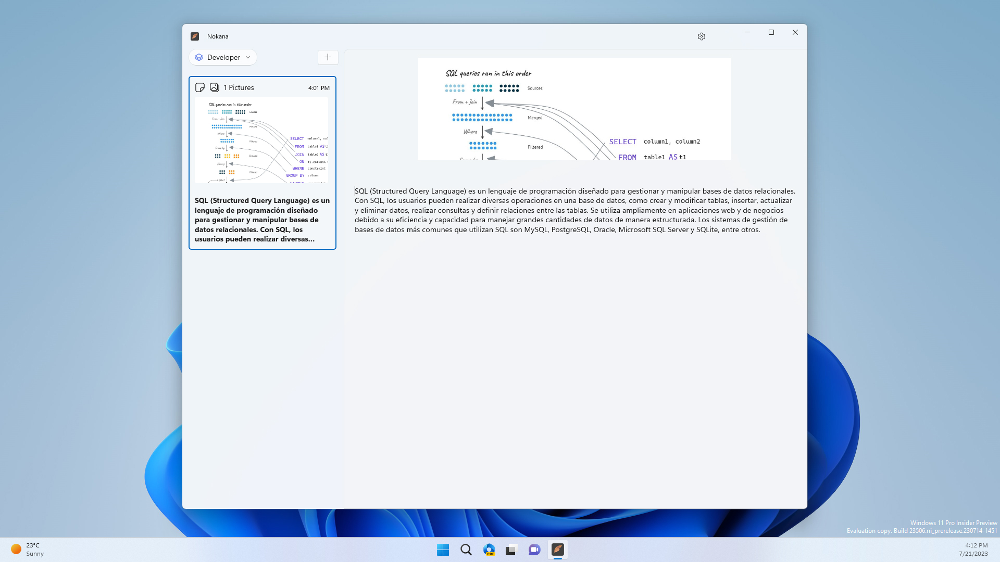
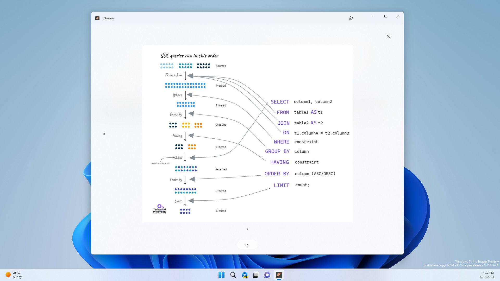

    

# Nokana
Welcome to the official repo for **Nokana**.

 

### Description
Nokana is an innovative note storage application designed to boost productivity and organization. With Nokana, you can create and organize your notes into personalized workspaces, allowing you to keep all your important information in one place. Capture ideas, to-dos, reminders and more quickly and easily. Nokana's intuitive interface allows you to easily access your notes at any time and from any device - simplify your life and streamline your workflow with Nokana!"

 

---

## Autor

	
	 
	<a href="https://github.com/alexfalconflores">Alex Stefano Falcon Flores</a>

