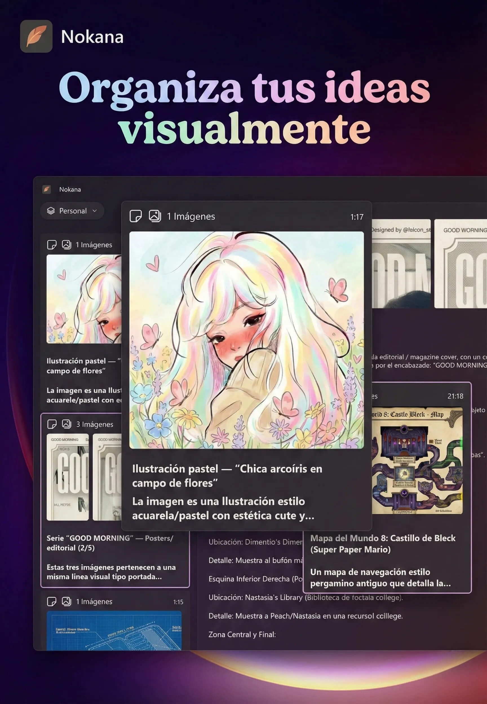
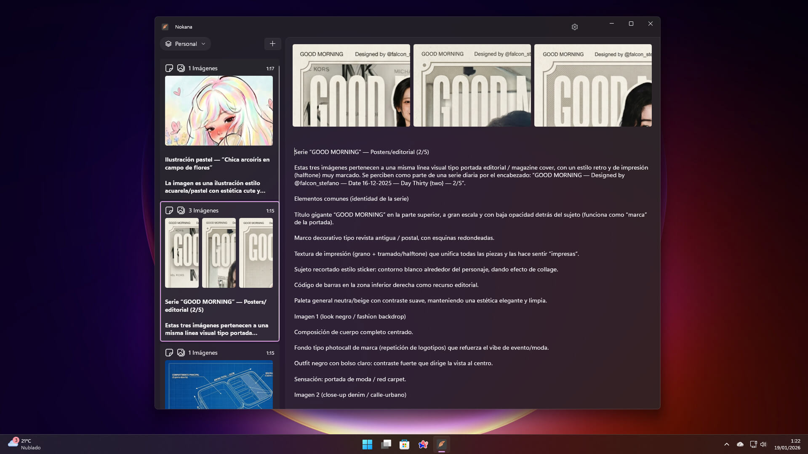
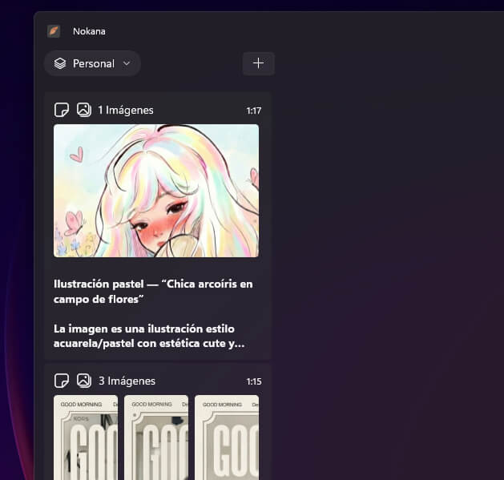
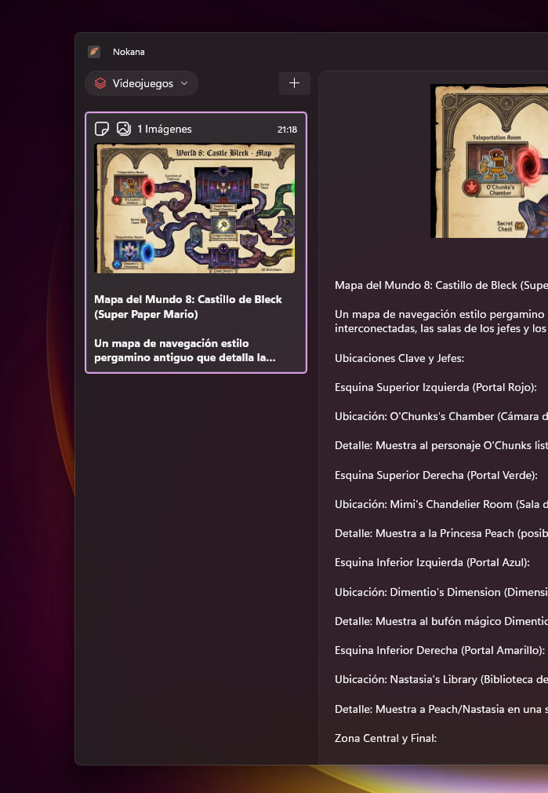
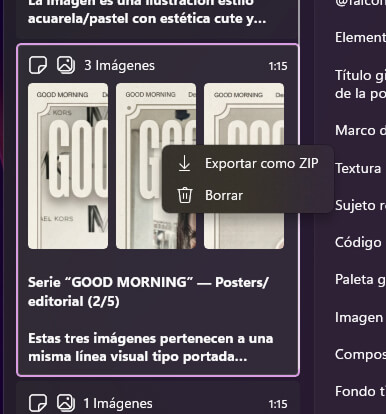
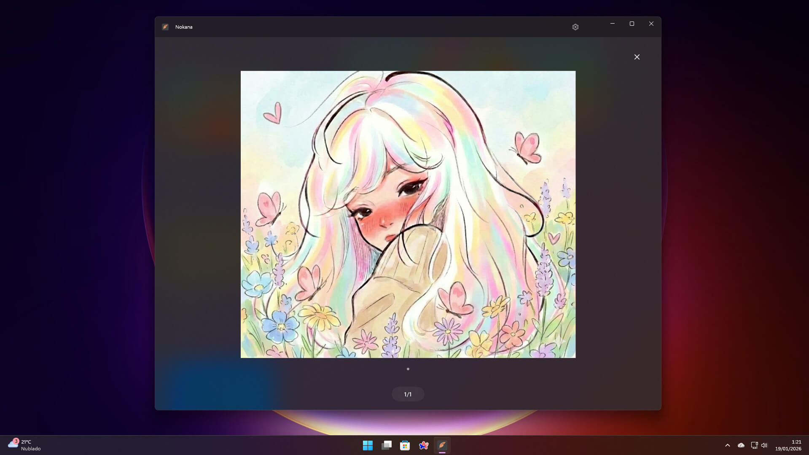

    

# Nokana
Welcome to the official repo for **Nokana**.

 

### Description
Nokana is the note-taking app designed to feel right at home on Windows. Forget slow web apps; Nokana is fast, smooth, and respects your privacy by storing everything locally on your device.

Whether you're a student, developer, or just someone who likes to keep everything organized, Nokana adapts to you. Create multiple “Workspaces” to separate your personal life from your work projects.

Key Features:

📝 Rich Text Editor: Write freely. Bold, italics, lists, and more. Everything you need to express yourself.

📂 Workspaces: Organize your notes into separate categories (Work, Personal, College) to stay focused.

🖼️ Image Support: Drag and drop images directly into your notes. View them in a built-in gallery or within the text.

🔒 Local Privacy: Your data is yours. Nokana uses a local SQLite database. Nothing is uploaded to the cloud without your permission.

🚀 Export and Backups: Need to share? Export your notes individually to a ZIP file (with images included) or make a complete backup of the entire application in seconds.

🎨 Modern Design: Enjoy a clean interface that supports Light and Dark themes, integrating seamlessly with your Windows style.

Download Nokana today and start organizing your ideas elegantly and quickly.

 

---

## Autor

	
	 
	<a href="https://github.com/alexfalconflores">Alex Stefano Falcon Flores</a>

